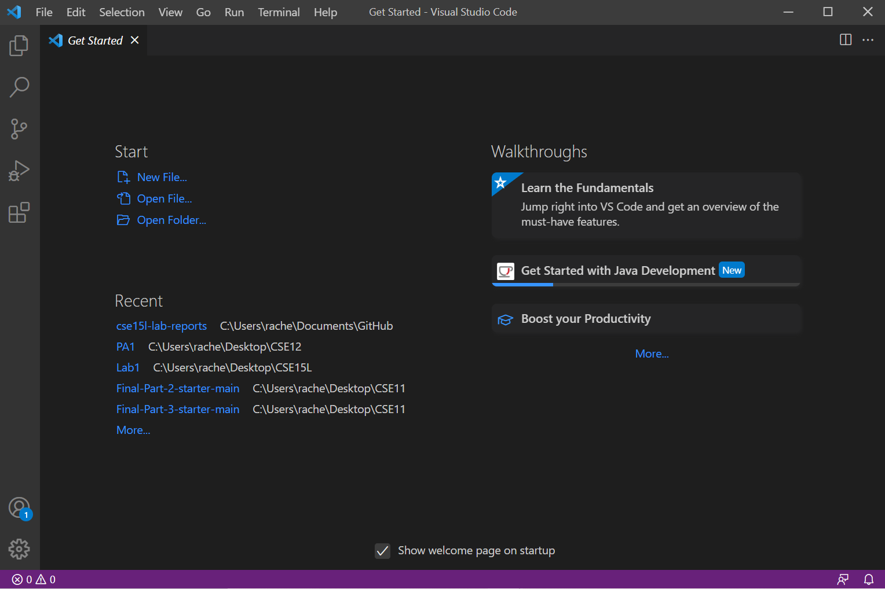

# Lab Report 1

## Remote access: How to log into a course-specific account on `ieng6`.
___________________

> **Step 1: Installing VSCode**

1. Click [here](https://code.visualstudio.com/) to find the download for VSCode
2. Follow the directions on the site to complete setup

If you successfully downloaded VSCode, you should see see a window similar to this: 

> **Step 2: Remotely Connecting**

If you are on Windows, you will need to install a a program called OpenSSH. Follow the instructions on the site [here](https://docs.microsoft.com/en-us/windows-server/administration/openssh/openssh_install_firstuse) to get it on your computer. This will allow you to be able to connect to other comupters.

Next, look up your course-specific account for CSE15L [here](https://sdacs.ucsd.edu/~icc/index.php).

Now, we are ready to connect to the remote computer on `ieng6`.

1. On VSCode, open a new terminal and run the command below. Replace `zz` with the letters of your course-specific account.
```
$ ssh cs15lwi22zz@ieng6.ucsd.edu
```
2. If you a receive a message looking like this:
```
Are you sure you want to continue connecting (yes/no/[fingerprint])? 
```
Type `yes`, press enter, and enter in your password when prompted to do so.

This whole process should look something like this:


> **Step 3: Trying Some Commands**


> **Step 4: Moving Files with 'scp'**


> **Step 5: Setting an SSH Key**


> **Step 6: Optimizing Remote Running**