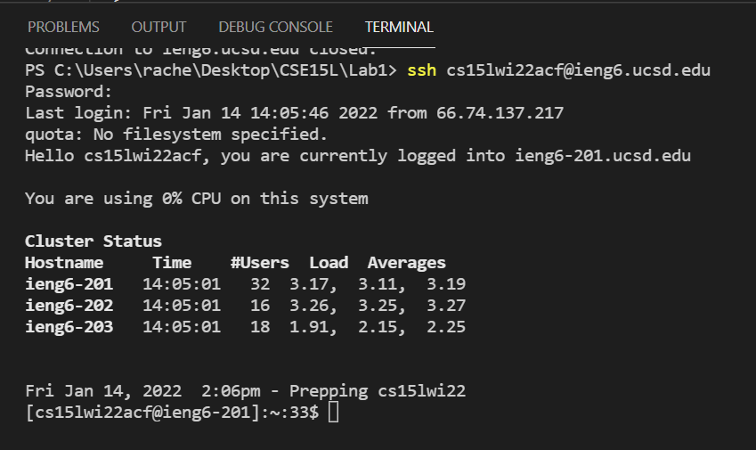
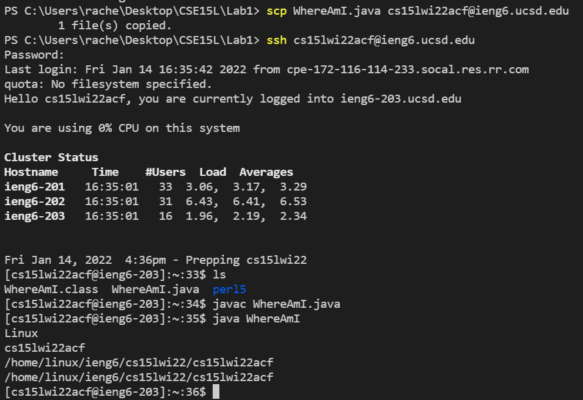

# Lab Report 1

## Remote access: How to log into a course-specific account on `ieng6`.
___________________

> **Step 1: Installing VSCode**

1. Click [here](https://code.visualstudio.com/) to find the download for VSCode
2. Follow the directions on the site to complete setup

If you successfully downloaded VSCode, you should see see a window similar to this: 

> **Step 2: Remotely Connecting**

If you are on Windows, you will need to install a a program called OpenSSH. Follow the instructions on the site [here](https://docs.microsoft.com/en-us/windows-server/administration/openssh/openssh_install_firstuse) to get it on your computer. This will allow you to be able to connect to other comupters.

Next, look up your course-specific account for CSE15L [here](https://sdacs.ucsd.edu/~icc/index.php).

Now, we are ready to connect to the remote computer on `ieng6`.

1. On VSCode, open a new terminal and run the command below. Replace `zz` with the letters of your course-specific account.
```
$ ssh cs15lwi22zz@ieng6.ucsd.edu
```
2. If you a receive a message looking like this:
```
Are you sure you want to continue connecting (yes/no/[fingerprint])? 
```
Type `yes`, press enter, and enter in your password when prompted to do so.

This whole process should look something like this:


Notice that you are now logged into the remote computer from your local computer.


> **Step 3: Trying Some Commands**

Now we can try running some commands in both your computer and the remote computer after using `ssh`. 
* `cd` : changes your directory
* `ls` : lists the files in the directory
* `pwd` : prints the working directory
* `exit` or CTRL+D : logs out of the remote server

Here are some examples of what happens when you run these commands:


> **Step 4: Moving Files with `scp`**

Now we can start to copy files to and from the remote computer with the `scp` command.
First, you will need to create a file called `WhereAmI.java` to practice moving files back and forth.

```
class WhereAmI {
  public static void main(String[] args) {
    System.out.println(System.getProperty("os.name"));
    System.out.println(System.getProperty("user.name"));
    System.out.println(System.getProperty("user.home"));
    System.out.println(System.getProperty("user.dir"));
  }
}
```

You can run this file using `javac` and `java` on your computer and observe the message printed.

Run the command below and enter your password when prompted to. Again, replace `zz` with your course-specific account.

```
scp WhereAmI.java cs15lwi22zz@ieng6.ucsd.edu:~/
```
Now, you can log into ieng6 using the `ssh` command from Step 2, and test the `ls` command. You should see that the `WhereAmI.java` file has successfully copied over to the remote computer, and you can run the `javac` and `java` commands from the remote server. 

This process should look something like this:

(Note: Both `WhereAmI.java` and `WhereAmI.class` are listed on the remote server after running `ls` because I had previously ran `javac` on the remote server)


> **Step 5: Setting an SSH Key**


> **Step 6: Optimizing Remote Running**

Here are some command tricks to help you make running commands more efficient and help save time:
* Writing a command in quotes after a `ssh` command will run it on the remote server and log out. Ex. The command below will print the working directory on the remote server after logging in:
```
$ ssh cs15lwi22@ieng6.ucsd.edu "pwd"
```
* Separting commands with semicolons on the same line will run multiple commands.
* To avoid typing in the same command over and over again, you can use the up-arrow on the keyboard to get the recent commands used in the terminal.