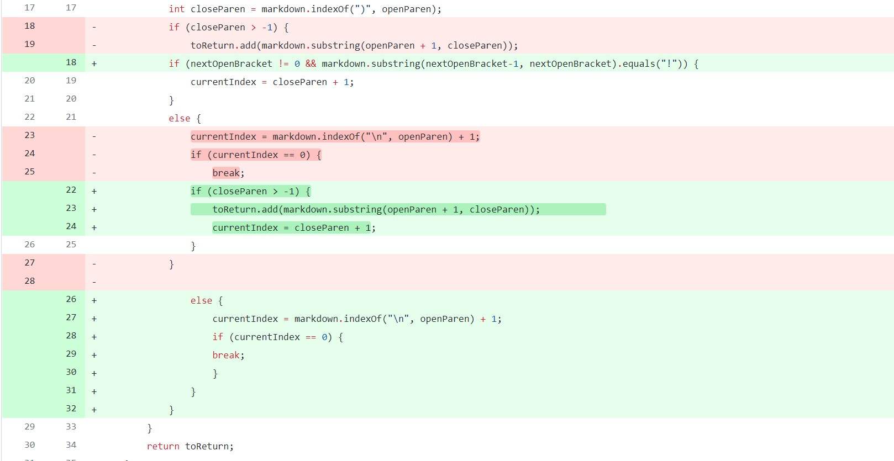
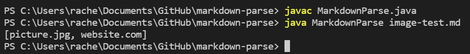

# Lab Report 2

## Symptoms and Debugging
___________________________________________

For this lab, we worked with a file called `MarkdownParse.java`, which would read a markdown file and print out links that were in that file.

>**Problem 1: Wrong syntax**

Here is the test file with a failure-inducing output that prompted me to make the above change: [`breaking-test.md`](https://github.com/r-chau/markdown-parse/blob/main/breaking-test.md)

Here is the output and symptom that `breaking-test.md` caused when running `java MarkdownParse breaking-test.md`:

Shown in the terminal above, the file goes into an infinite loop. This is because in `breaking-test.md`, the file does not contain closing parentheses, which the code looks for, and the current index does not update enough to break out of the while loop. 

>**Problem 2: Links vs Images**

Here is the test file with a failure-inducing output that prompted me to make the above change: [`image-test.md`](https://github.com/r-chau/markdown-parse/blob/main/image-test.md)

Here is the output and symptom that `image-test.md` caused when running `java MarkdownParse image-test.md`:

Shown in the terminal above, the code prints out both the image and the link. This shows that the code does not know how to denote between a link and image file, so I had to update the code to be able to check to see if a line has a "`!`" before the open bracket. 
