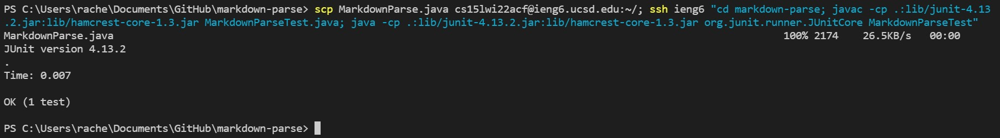

# Lab Report 3

## Copying Whole Directories with `scp -r`
___________________________________

To make copying files over a lot easier, we can even copy over whole directories by asking `scp` to copy recursively, so we can copy the entire `markdown-parse` directory to the server in a single command.


We can use `scp` to copy the directory above by use this command:
```
$ scp -r . cs15lwi22@ieng6.ucsd.edu:~/markdown-parse
```

`-r` tells `scp` to work recursively. `.` is the source, and is the current directory. `~/markdown-parse` tells `scp` to create `markdown-parse` on the remote server and copy the contents of that directory onto the server.
The result will look something like this:


Now we can logg in with `ssh` and see that the files have been copied over in a `markdown-parse` directory.


This command copies files from `.git` as well, and not just the files we see when using `ls`. To have more control over what gets copied over, we can use the command below.

```
scp -r *.java *.md lib/ cs15lwi22@ieng6.ucsd.edu:markdown-parse
```


As you can see, by adding `*.java` and `*.md`, `scp` only copies those files over, instead of everything in the `markdown-parse` directory.

Below, I am showing myself logging in through `ssh` and then running `MarkdownParseTest.java` on the remote server:


Now, we can even come up with a command to copy a whole directory over and run tests on the remote server by combining `scp`, `;`, and `ssh`.


