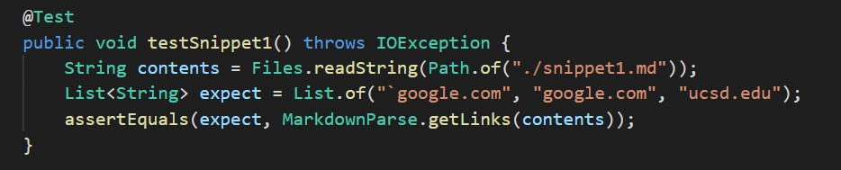
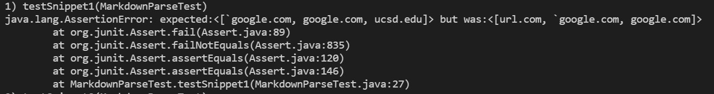
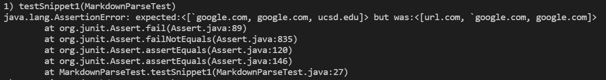
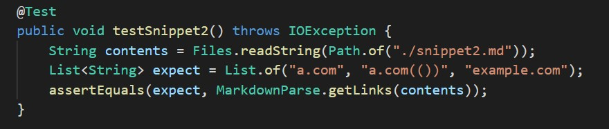
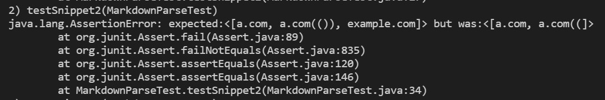
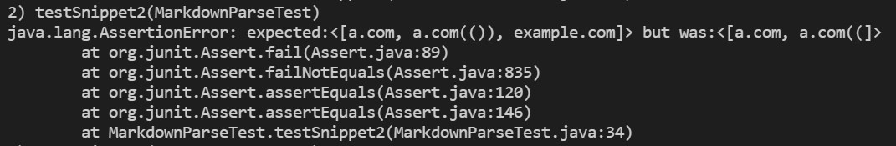
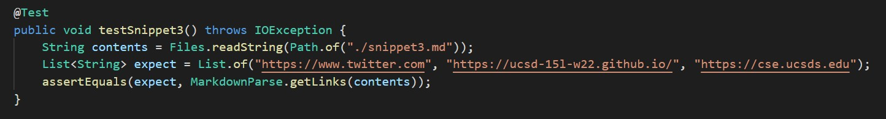
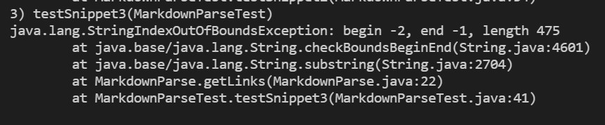
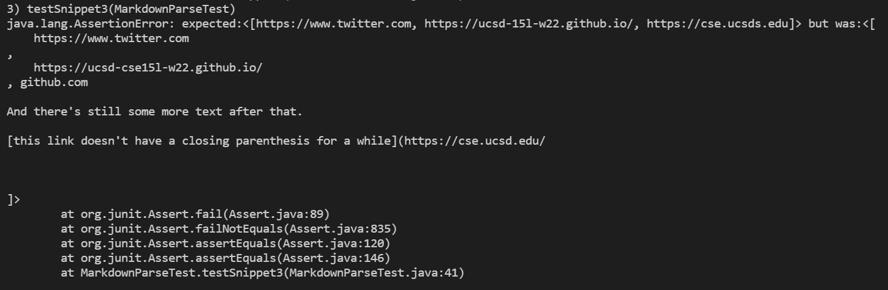

# Lab Report 4

Click [here](https://github.com/r-chau/markdown-parse) to access my markdown-parse repository and [here](https://github.com/ajwboi/markdown-parse) for the one I reviewed.

> **Snippet 1**

```
`[a link`](url.com)

[another link](`google.com)`

[`cod[e`](google.com)

[`code]`](ucsd.edu)
```

Using VSCode preview, this is what the above markdown file should produce:

`` `google.com``

`google.com`

`ucsd.edu`

Here is how I turned it into a test in `MarkdownParseTest.java`:


For **my implementation**, when running the tests, here is the specific part of the JUnit output that shows the test failure:


For the implementation that I reviewed, when running the tests, here is the specific part of the JUnit output that shows the test failure:


> **Snippet 2**

```
[a [nested link](a.com)](b.com)

[a nested parenthesized url](a.com(()))

[some escaped \[ brackets \]](example.com)
```

Using VSCode preview, this is what the above markdown file should produce:

`a.com`

`a.com(())`

`example.com`

Here is how I turned it into a test in `MarkdownParseTest.java`:


For **my implementation**, when running the tests, here is the specific part of the JUnit output that shows the test failure:


For the implementation that I reviewed, when running the tests, here is the specific part of the JUnit output that shows the test failure:


> **Snippet 3**

```
[this title text is really long and takes up more than 
one line

and has some line breaks](
    https://www.twitter.com
)

[this title text is really long and takes up more than 
one line](
    https://ucsd-cse15l-w22.github.io/
)


[this link doesn't have a closing parenthesis](github.com

And there's still some more text after that.

[this link doesn't have a closing parenthesis for a while](https://cse.ucsd.edu/


)

And then there's more text
```

Using VSCode preview, this is what the above markdown file should produce:

`https://www.twitter.com`
`https://ucsd-15l-w22.github.io/`
`https://cse.ucsd.edu`

Here is how I turned it into a test in `MarkdownParseTest.java`:


For **my implementation**, when running the tests, here is the specific part of the JUnit output that shows the test failure:


For the implementation that I reviewed, when running the tests, here is the specific part of the JUnit output that shows the test failure:


> **Changes**

1. I do not think there is a small (<10 lines) of code change that will make my program work for Snippet 1 and all related cases that use inline code because I would have to write code to recognize backticks as an indicator that there is inline code. Even now, it is difficult to debug and address syntax errors for `getLinks`, so it would take a lot of programming to fix all related cases with a `getCode` method in `MarkdownParse.java`.

2. I think there is a not too complicated code change to make my program work for Snippet 2 and all related cases that nests parentheses, brackets, and escaped brackets. I beleive we could add a counter to keep track of the number of open brackets/parentheses (count++) until the next closed brackets/parentheses (count--), and use this counter to decide whether or not something is or is not included in the link.

3. I do not think that there is a small (<10 lines) of code change that will make my program work for Snippet 3 and all related cases that have newlines in brackets and parentheses. Because my code causes an `IndexOutOfBoundsException`, I would have to debug that code and make sure all my test files I had before still produce the inteded output. Then I would have to go about figuring out how I would make Snippet 3 pass (I think we could do this by ignoring whitespace between the parentheses, and go on from there).)