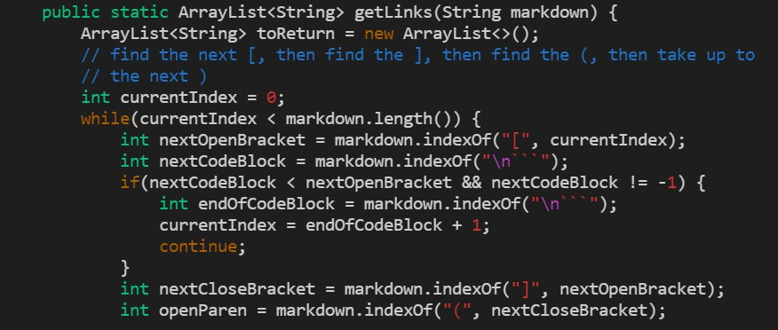
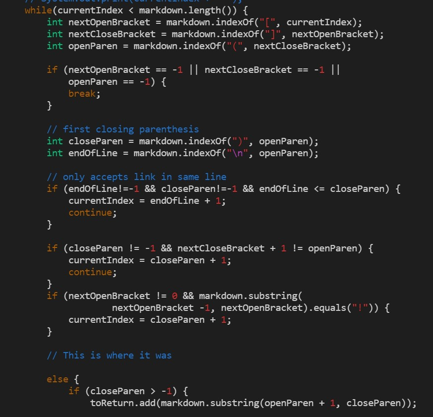

# Lab Report 5

Link to the student repository I used: [https://github.com/smissula/markdown-parse](https://github.com/smissula/markdown-parse)

Link to the provided repository to compare to: [https://github.com/ucsd-cse15l-w22/markdown-parse](https://github.com/ucsd-cse15l-w22/markdown-parse)

To find the tests that provided different results, I first had the outputs of tests in a text file by running `bash script.sh > results.txt` on each directory. This command redirects the output into the text file. Then, I ran the `diff` command below to find the tests with different results.

```
diff sri-mdparse/results.txt lab-9-mdparse/results.txt
```

By looking at the output of this command, I was able to find two tests that provided different results.

## **`577.md`**

This is what I found after using `diff`:


This tell us that on line 1062 of the `results.txt` files, the student's `markdown-parse` produces `[]`, while the provided implementation produces `[train.jpg]`. We can find this by heading to that line in both the `results.txt` files.

Our implementation: 

Given implementation: 

This shows us that the `577.md` test file is causing the different outputs. These are the contents of `577.md`:
```

```
Since this is the syntax for an image and not a link, the correct output should be just `[]`, so our group's implementation was correct. 
Here is the code of the provided implementation:


The problem with this code is that it does not differentiate between a link and an image. This can be resolved by inserting an if-statement checking if the index before `nextOpenBracket` is equal to `!`, which indicates that it is a image instead of a link, and then updating `currentIndex` to be `closeParen + 1`, skipping past the image.


## **`567.md`**

This is what I found after using `diff`:


This tell us that on line 1040 of the `results.txt` files, the student's `markdown-parse` produces `[not a link]`, while the provided implementation produces `[]`. We can find this by heading to that line in both the `results.txt` files.

Our implementation: 

Given implementation: 

This shows us that the `567.md` test file is causing the different outputs. These are the contents of `567.md`:
```
[foo](not a link)

[foo]: /url1
```
The correct expected output for this test file should be `[]`, so the given implementation produces the correct output. Here is the code of our group's implementation:


The problem with this code is that it does not check if there is any empty space between the parentheses, which makes a link not valid. This can be resolved by checking if the substring from `openParen` to `closeParen` contains an open space, and updating `currentIndex` accordingly so that it is not added to `toReturn` if an empty space is found.